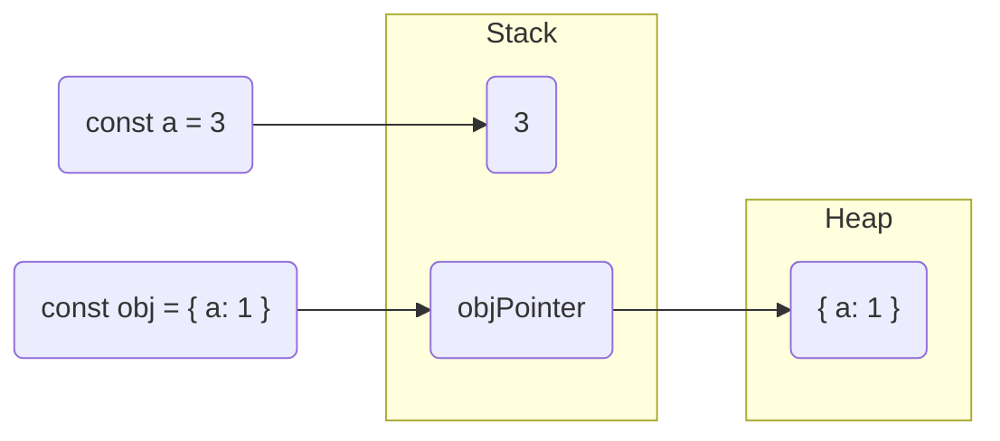
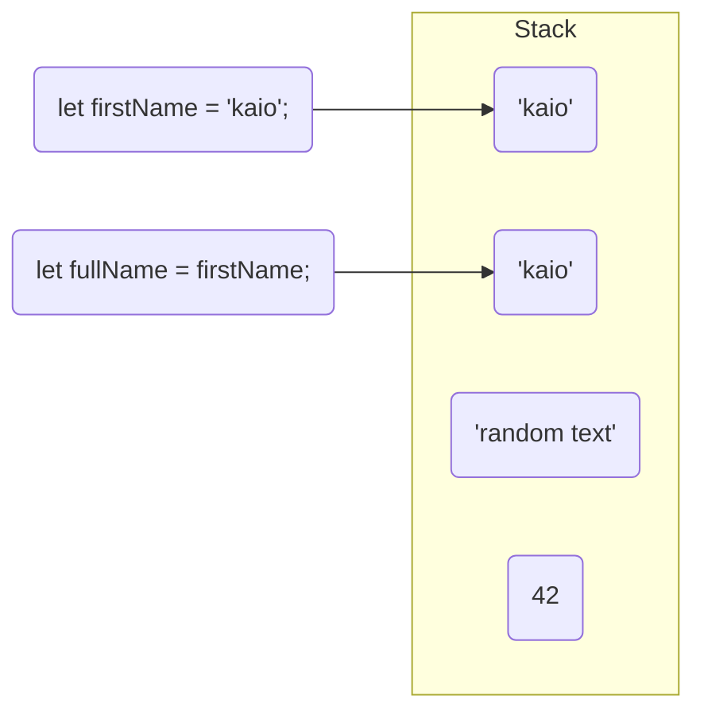
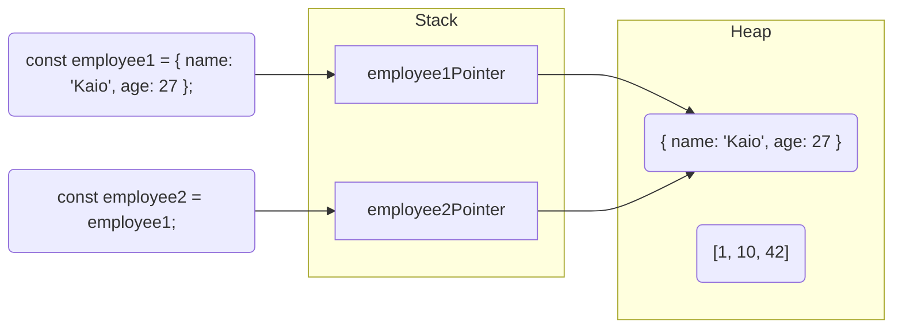

[](https://github.com/kaiosilveira/encpasulate-variable-refactoring/actions/workflows/ci.yml)

ℹ️ _This repository is part of my "refactoring" catalog based on Fowler's book with the same title. Please see [kaiosilveira/refactoring](https://github.com/kaiosilveira/refactoring) for more details._

---

# Encapsulate Variable

**Formerly: Self Encapsulate Field**
<br />
**Formerly: Encapsulate Field**

<table>
<thead>
<th>Before</th>
<th>After</th>
</thead>
<tbody>
<tr>
<td>

```javascript
let defaultOwner = { firstName: 'Kaio', lastName: 'Silveira' };
```

</td>

<td>

```javascript
let defaultOwnerData = { firstName: 'Kaio', lastName: 'Silveira' };

export function defaultOwner() {
  return defaultOwnerData;
}

export function setDefaultOwner(arg) {
  defaultOwnerData = arg;
}
```

</td>
</tr>
</tbody>
</table>

Global variables are a well-known pain in the development world, not only because it is hard to reason about and keep track of, but also because when the time comes to change it, it's really hard to apply a straightforward, clean refactoring, due to a lot of problems that arise as soon as we touch them. This refactoring provides a strategy to deal with these cases.

## Working example

As our working example, we will be refactoring a simple piece of code that uses a `defaultOwner` global variable so the callers can use its accessors instead of manipulating it directly. The caller code looks like this:

```javascript
let defaultOwner = { firstName: 'Kaio', lastName: 'Silveira' };
let spaceship = { name: 'Nebuchadnezzar' };

spaceship.owner = defaultOwner;

// lots of spaghetti code

defaultOwner.firstName = 'Morpheus';
defaultOwner.lastName = '';

console.log(spaceship.owner);
```

### Test suite

There are two test suites for this example. The first one covers the getter and setter functions for the `defaultOwner` variable, and the second one covers the basic configuration for the `Person` class that will be introduced later in the refactoring steps.

### Steps

To start with this refactoring, we need to create an indirection to protect callers from directly accessing the `defaultOwner` variable. We can do that by creating getter and setter functions to return and manipulate the variable's data, and update the callers to use these accessors instead of touching the variable directly:

```diff
diff --git a/caller.js b/caller.js
@@ -1,9 +1,16 @@
 let defaultOwner = { firstName: 'Kaio', lastName: 'Silveira' };
-let spaceship = { name: 'Nebuchadnezzar' };

-spaceship.owner = defaultOwner;
+function getDefaultOwner() {
+  return defaultOwner;
+}
+
+function setDefaultOwner(arg) {
+  defaultOwner = arg;
+}
+
+let spaceship = { name: 'Nebuchadnezzar' };

-defaultOwner.firstName = 'Morpheus';
-defaultOwner.lastName = '';
+spaceship.owner = getDefaultOwner();
+setDefaultOwner({ firstName: 'Morpheus', lastName: '' });

 console.log(spaceship.owner);
```

After we've done that, we can move the `defaultOwner` variable and its accessors to a separate file and update the callers:

```diff
diff --git a/caller.js b/caller.js
@@ -1,12 +1,4 @@
-let defaultOwner = { firstName: 'Kaio', lastName: 'Silveira' };
-
-function getDefaultOwner() {
-  return defaultOwner;
-}
-
-function setDefaultOwner(arg) {
-  defaultOwner = arg;
-}
+const { getDefaultOwner, setDefaultOwner } = require('./default-owner');

 let spaceship = { name: 'Nebuchadnezzar' };

diff --git a/default-owner.js b/default-owner.js
@@ -0,0 +1,11 @@
+let defaultOwner = { firstName: 'Kaio', lastName: 'Silveira' };
+
+function getDefaultOwner() {
+  return defaultOwner;
+}
+
+function setDefaultOwner(arg) {
+  defaultOwner = arg;
+}
+
+module.exports = { getDefaultOwner, setDefaultOwner };

diff --git a/default-owner.test.js b/default-owner.test.js
@@ -0,0 +1,21 @@
+const { getDefaultOwner, setDefaultOwner } = require('./default-owner');
+
+describe('defaultOwner', () => {
+  describe('getDefaultOwner', () => {
+    it('should return the default owner', () => {
+      const owner = getDefaultOwner();
+      expect(owner.firstName).toEqual('Kaio');
+      expect(owner.lastName).toEqual('Silveira');
+    });
+  });
+
+  describe('setDefaultOwner', () => {
+    it('should change the default owner', () => {
+      setDefaultOwner({ firstName: 'Enzo', lastName: 'Silveira' });
+
+      const owner = getDefaultOwner();
+      expect(owner.firstName).toEqual('Enzo');
+      expect(owner.lastName).toEqual('Silveira');
+    });
+  });
+});
```

And then, let's say in the meantime we had some updates to the `caller.js` code, which caused some interesting side effects to the `defaultOwner` global variable:

```diff
diff --git a/caller.js b/caller.js
@@ -2,7 +2,14 @@ const { getDefaultOwner, setDefaultOwner } = require('./default-owner');

 let spaceship = { name: 'Nebuchadnezzar' };

-spaceship.owner = getDefaultOwner();
-setDefaultOwner({ firstName: 'Morpheus', lastName: '' });
+const owner = getDefaultOwner();
+spaceship.owner = owner;
+
+setDefaultOwner({ firstName: 'Gabriella', lastName: 'Caetano' });
+
+// lots of spaghetti code
+
+owner.firstName = 'Morpheus';
+owner.lastName = '';

 console.log(spaceship.owner);
```

Note how `owner` is being changed further down in the spaghetti implementation of `caller.js`, which will cause the `defaultOwner` value to be updated as well as a hard-to-track side effect (see [Appendix #1 - how variable referencing and manipulation works in Javascript](#appendix-1---how-variable-referencing-and-manipulation-works-in-javascript) for details). But for now, let's leave this bug there and move on with the refactoring.

We can rename `getDefaultOwner` to simply `defaultOwner` and update the callers:

```diff
diff --git a/caller.js b/caller.js
@@ -1,8 +1,8 @@
-const { getDefaultOwner, setDefaultOwner } = require('./default-owner');
+const { defaultOwner, setDefaultOwner } = require('./default-owner');

 let spaceship = { name: 'Nebuchadnezzar' };

-const owner = getDefaultOwner();
+const owner = defaultOwner();
 spaceship.owner = owner;

 setDefaultOwner({ firstName: 'Gabriella', lastName: 'Caetano' });
diff --git a/default-owner.js b/default-owner.js
@@ -1,11 +1,11 @@
-let defaultOwner = { firstName: 'Kaio', lastName: 'Silveira' };
+let defaultOwnerData = { firstName: 'Kaio', lastName: 'Silveira' };

-function getDefaultOwner() {
-  return defaultOwner;
+function defaultOwner() {
+  return defaultOwnerData;
 }

 function setDefaultOwner(arg) {
-  defaultOwner = arg;
+  defaultOwnerData = arg;
 }

-module.exports = { getDefaultOwner, setDefaultOwner };
+module.exports = { defaultOwner, setDefaultOwner };

diff --git a/default-owner.test.js b/default-owner.test.js
@@ -1,9 +1,9 @@
-const { getDefaultOwner, setDefaultOwner } = require('./default-owner');
+const { defaultOwner, setDefaultOwner } = require('./default-owner');

 describe('defaultOwner', () => {
   describe('getDefaultOwner', () => {
     it('should return the default owner', () => {
-      const owner = getDefaultOwner();
+      const owner = defaultOwner();
       expect(owner.firstName).toEqual('Kaio');
       expect(owner.lastName).toEqual('Silveira');
     });
@@ -13,7 +13,7 @@ describe('defaultOwner', () => {
     it('should change the default owner', () => {
       setDefaultOwner({ firstName: 'Enzo', lastName: 'Silveira' });

-      const owner = getDefaultOwner();
+      const owner = defaultOwner();
       expect(owner.firstName).toEqual('Enzo');
       expect(owner.lastName).toEqual('Silveira');
     });
```

And then we finally noticed the bug and decided to fix it. To do so, we can return a copy of `defaultOwnerData` instead of a reference to the original object:

```diff
diff --git a/default-owner.js b/default-owner.js
@@ -1,7 +1,7 @@
 let defaultOwnerData = { firstName: 'Kaio', lastName: 'Silveira' };

 function defaultOwner() {
-  return defaultOwnerData;
+  return Object.assign({}, defaultOwnerData);
 }

 function setDefaultOwner(arg) {

diff --git a/default-owner.test.js b/default-owner.test.js
@@ -10,6 +10,14 @@ describe('defaultOwner', () => {
   });

   describe('setDefaultOwner', () => {
+    beforeEach(() => {
+      setDefaultOwner({ firstName: 'Kaio', lastName: 'Silveira' });
+    });
+
+    afterEach(() => {
+      setDefaultOwner({ firstName: 'Kaio', lastName: 'Silveira' });
+    });
+
     it('should change the default owner', () => {
       setDefaultOwner({ firstName: 'Enzo', lastName: 'Silveira' });

@@ -17,5 +25,14 @@ describe('defaultOwner', () => {
       expect(owner.firstName).toEqual('Enzo');
       expect(owner.lastName).toEqual('Silveira');
     });
+
+    it('should not change the original record when changing props directly', () => {
+      const originalOwner = defaultOwner();
+
+      let owner = defaultOwner();
+      owner.firstName = 'Enzo';
+
+      expect(originalOwner.firstName).toEqual('Kaio');
+    });
   });
 });
```

We also introduced a test to make sure this side effect is not happening anymore.

With this change, the client code will always have access to a copy of the actual data, so any changes to this copy will not be reflected in the existing `defaultOwnerData` global variable.

What about nested object properties, though? This is the main gotcha when it comes to `Object.assign`: it creates shallow copies of the properties in a given object, but still keeps pointer references to the original object structure in the Heap when it's a complex object, so we can run into the same problem even when using it as a partial solution.

To push this protection forward, we can introduce a `Person` class to wrap the owner's data and expose getters to each field...

```diff
diff --git a/person.js b/person.js
@@ -0,0 +1,16 @@
+class Person {
+  constructor(data) {
+    this._firstName = data.firstName;
+    this._lastName = data.lastName;
+  }
+
+  get firstName() {
+    return this._firstName;
+  }
+
+  get lastName() {
+    return this._lastName;
+  }
+}
+
+module.exports = Person;

diff --git a/person.test.js b/person.test.js
@@ -0,0 +1,9 @@
+const Person = require('./person');
+
+describe('Person', () => {
+  it('should have a first name and a last name based on the data provided', () => {
+    const person = new Person({ firstName: 'Kaio', lastName: 'Silveira' });
+    expect(person.firstName).toEqual('Kaio');
+    expect(person.lastName).toEqual('Silveira');
+  });
+});
```

... and start using it instead of the POJO in `default-owner.js`:

```diff
diff --git a/default-owner.js b/default-owner.js
@@ -1,11 +1,13 @@
-let defaultOwnerData = { firstName: 'Kaio', lastName: 'Silveira' };
+const Person = require('./person');
+
+let defaultOwnerData = new Person({ firstName: 'Kaio', lastName: 'Silveira' });

 function defaultOwner() {
-  return Object.assign({}, defaultOwnerData);
+  return new Person(defaultOwnerData);
 }

 function setDefaultOwner(arg) {
-  defaultOwnerData = arg;
+  defaultOwnerData = new Person(arg);
 }

 module.exports = { defaultOwner, setDefaultOwner };
```

This will cause the `caller.js` code to throw an error when trying to assign a new value to `firstName` or `lastName`, **but only if we're running the code in strict mode!**, so we need to wrap `caller.js` into an IIFE (Immediately Invocated Function Expression) and call `'use strict;'` at the top of the function:

```diff
diff --git a/caller.js b/caller.js
@@ -1,15 +1,18 @@
-const { defaultOwner, setDefaultOwner } = require('./default-owner');
+(() => {
+  'use strict';

-let spaceship = { name: 'Nebuchadnezzar' };
+  const { defaultOwner, setDefaultOwner } = require('./default-owner');

-const owner = defaultOwner();
-spaceship.owner = owner;
+  let spaceship = { name: 'Nebuchadnezzar' };

-setDefaultOwner({ firstName: 'Gabriella', lastName: 'Caetano' });
+  const owner = defaultOwner();
+  spaceship.owner = owner;

-// lots of spaghetti code
+  setDefaultOwner({ firstName: 'Gabriella', lastName: 'Caetano' });

-owner.firstName = 'Morpheus';
-owner.lastName = '';
+  // lots of spaghetti code

-console.log(spaceship.owner);
+  setDefaultOwner({ firstName: 'Morpheus', lastName: '' });
+
+  console.log(spaceship.owner);
+})();
```

And finally, we will be able to see the error when running the caller code:

```console
owner.firstName = 'Morpheus';
                ^
TypeError: Cannot set property firstName of #<Person> which has only a getter
    at encapsulate-variable/caller.js:15:19
    at Object.<anonymous> (encapsulate-variable/caller.js:19:3)
```

But it's Javascript, and as we all know, there are other paths to Asgard. A diabolic developer could access the private `_firstName` variable directly and change its value:

```javascript
owner._firstName = 'Morpheus';
```

And we can only protect against this kind of threat with good politics and thorough code reviews.

### Commit history

The commit history for the steps described above are:

| Commit SHA                        | Message                                                                         |
| --------------------------------- | ------------------------------------------------------------------------------- |
| [0597387](https://bit.ly/3Kz5fCE) | introduce getter and setter for defaultOwner                                    |
| [0f7150d](https://bit.ly/3CKTnf6) | move defaultOwner and its accessors to their own file                           |
| [040bbe2](https://bit.ly/3CKXrf6) | update default owner                                                            |
| [3ea6afe](https://bit.ly/3R5y4cs) | rename getDefaultOwner to defaultOwner                                          |
| [7876511](https://bit.ly/3R6L29I) | return a copy of defaultOwnerData instead of a reference to the original object |
| [e2db572](https://bit.ly/3TtRKrU) | introduce Person class                                                          |
| [0f40b26](https://bit.ly/3ecRD45) | use Person class instead of raw object in default-owner.js                      |
| [760fe3e](https://bit.ly/3AAovLE) | wrap caller.js in strict mode                                                   |

For the full commit history, see [the Commit History tab](https://github.com/kaiosilveira/encapsulate-variable-refactoring/commits/main).

## Appendix #1 - how variable referencing and manipulation works in Javascript

In Javascript, memory allocation may work differently depending on the data type you are going to store. For primitive types like `string` and `number`, the value will be held in the Stack and the variables will point directly to it. For complex objects, though, like `array` or any `object`, there will be a pointer in the Stack, but the actual data will be stored in the Heap memory. Being aware of this behavior helps avoid annoying debugging sessions. Below is a list of data types and the place where each of them is stored:

| Data type | Kind      | Allocated in |
| --------- | --------- | ------------ |
| `String`  | Primitive | Stack        |
| `Number`  | Primitive | Stack        |
| `Boolean` | Primitive | Stack        |
| `Symbol`  | Primitive | Stack        |
| `Null`    | Primitive | Stack        |
| `Array`   | Complex   | Heap         |
| `Object`  | Complex   | Heap         |

Let's consider the following code as an example:

```javascript
const a = 3;
const obj = { a: 1 };
```

The following chart shows how the allocation will work for these assignments above:



### Example #1: Simple values

Consider the following code:

```javascript
let firstName = 'Kaio';
let fullName = firstName;

fullName = 'Enzo';
```

What will be the value of `firstName` after we execute it? To help us understand that, let's have a look at the following chart:



As the chart explains, if we're assigning a variable to a primitive data type, such as `string` in the above code, a new entry will be created in the stack and the variable will hold the memory address for this new entry, so any modifications on the variable's value will not impact the value it was originated from.

### Example #2: Complex objects

For complex objects, things are a little bit more involved. Let's consider the following code:

```javascript
const employee1 = { name: 'Kaio', age: 27 };
const employee2 = employee1;

employee2.name = 'Enzo';
```

What is the value of `employee1.name` after executing it? Yes, it will be `'Enzo'`. The chart below explains why:



Note how each `employee*` variable has its own pointer in the Stack, but these pointers all target the same entry in the Heap. This means that any changes to the data structure will be replicated to all the pointers holding a reference to it.
